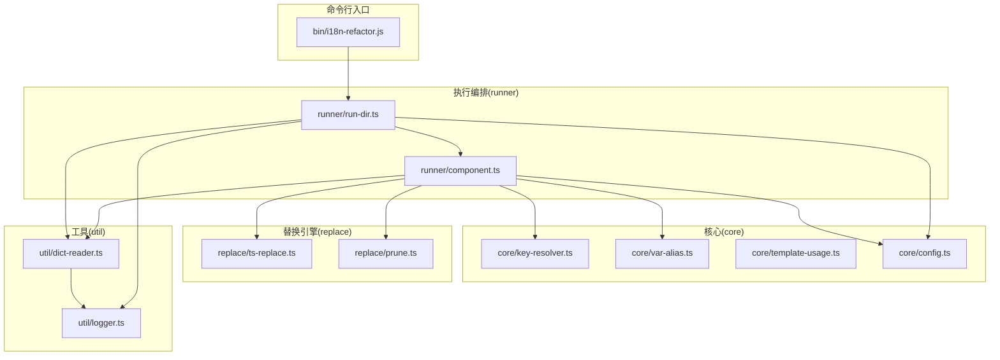

# i18n-refactor 工具 Wiki 文档

## 1. 项目概述

### 1.1 项目名称和简要描述
**i18n-refactor** 是一个专门用于Angular应用程序的国际化代码重构工具。该工具旨在自动将项目中分散的、非标准化的国际化（i18n）访问方式统一为标准格式，提高代码的一致性和可维护性。

### 1.2 核心功能和目标
- **目标**: 自动将 TS/HTML 中的词条访问统一为 `this.i18n.get('key', params)` 与 `{{ 'key' | i18n: params }}`，支持别名识别、根前缀选择与参数还原
- **适用**: Angular 组件内通过 `this.locale.getLocale()` 或已有 `this.i18n`/`this.dict` 等别名访问词条的代码与模板
- **主要功能**:
  - 识别并转换各种国际化访问模式
  - 自动处理别名和根前缀
  - 支持参数链式调用转换
  - 生成标准化的国际化调用
  - 提供多种运行模式（替换、还原、初始化等）

### 1.3 技术栈说明
- **编程语言**: TypeScript
- **框架**: Angular 17+
- **依赖库**: @ngx-translate/core, @ngx-translate/http-loader
- **构建工具**: TypeScript Compiler (tsc)
- **测试框架**: Jest
- **模块系统**: CommonJS

### 1.4 适用场景
- Angular项目中存在多种国际化访问方式需要统一
- 需要重构旧版国际化代码以符合新标准
- 自动化处理大量组件中的国际化调用
- 国际化代码的标准化和规范化

## 2. 快速开始

### 2.1 环境要求
- Node.js >= 16.x
- npm >= 8.x
- Angular CLI (可选，用于项目开发)

### 2.2 安装步骤
1. 克隆项目：
```bash
git clone <repository-url>
cd i18n-refactor
```

2. 安装依赖：
```bash
npm install
```

### 2.3 基本配置
项目根目录包含 `omrp.config.json` 配置文件，用于定义工具的行为：

```json
{
  "serviceTypeName": "I18nLocaleService",
  "getLocalMethod": "getLocale",
  "tsGetHelperName": "i18nGet",
  "dictDir": "src/app/i18n",
  "languages": ["zh", "en"],
  "jsonOutDir": "i18n-refactor/out",
  "jsonArrayMode": "nested",
  "dir": "src",
  "dryRun": false,
  "logLevel": "info",
  "format": "json"
}
```

### 2.4 首次运行指南
1. **构建工具**：
```bash
npm run i18n-refactor:build
```

2. **准备环境（Bootstrap）**：
```bash
node i18n-refactor/dist/src/runner/run-dir.js --mode=bootstrap
```

3. **执行替换（干运行测试）**：
```bash
node i18n-refactor/dist/src/runner/run-dir.js --dir=src --mode=replace --dry-run --logLevel=info --format=pretty
```

4. **应用替换（正式执行）**：
```bash
node i18n-refactor/dist/src/runner/run-dir.js --dir=src --mode=replace
```

## 3. 项目架构

### 3.1 目录结构说明
```
i18n-refactor/
├── bin/                    # 命令行入口
│   └── i18n-refactor.js
├── dist/                   # 编译输出目录
├── src/                    # 源代码目录
│   ├── core/              # 核心解析与规则层
│   │   ├── config.ts      # 配置管理
│   │   ├── key-resolver.ts # 键解析
│   │   ├── params-extractor.ts # 参数提取
│   │   ├── template-usage.ts # 模板使用
│   │   └── var-alias.ts   # 变量别名
│   ├── replace/           # 替换与清理引擎
│   │   ├── html-replace.ts # HTML替换
│   │   ├── prune.ts       # 清理无用代码
│   │   └── ts-replace.ts  # TS替换
│   ├── runner/            # 执行入口与编排层
│   │   ├── component.ts   # 组件处理
│   │   ├── dict-process-mode.ts # 字典处理模式
│   │   ├── i18n-service.template.ts # 服务模板
│   │   ├── mode-dispatcher.ts # 模式调度
│   │   ├── ngx-translate-injector.ts # 翻译注入
│   │   ├── process-and-delete-mode.ts # 处理删除模式
│   │   └── run-dir.ts     # 目录运行
│   └── util/              # 通用工具库
│       ├── dict-flatten.ts # 字典扁平化
│       ├── dict-reader.ts # 字典读取
│       ├── dict-simple.ts # 简单字典
│       ├── errors.ts      # 错误处理
│       ├── logger.ts      # 日志工具
│       └── variable-renamer.ts # 变量重命名
├── tests/                  # 测试文件
├── tsconfig.json          # TypeScript配置
└── 技术方案-全流程.md      # 技术方案文档
```

### 3.2 核心模块介绍
- **runner**: 执行入口与编排层，负责目录扫描、文件处理与结果汇总
- **core**: 核心解析与规则层，提供键解析、别名收集、模板使用提取等能力
- **replace**: 替换与清理引擎，负责 TS/HTML 文本替换与无用声明清理
- **util**: 通用工具库，提供字典读取、日志、错误等基础能力
- **bin**: 命令行入口，桥接 dist 输出与用户 CLI

### 3.3 模块间关系


### 3.4 数据流说明
1. 用户通过命令行调用工具
2. 命令行参数被解析并传递给主程序
3. 配置文件被加载并合并默认配置
4. 工具扫描目标目录中的文件
5. 对每个文件进行别名收集和键解析
6. 执行相应的替换或清理操作
7. 生成变更报告和输出文件

## 4. 功能特性

### 4.1 别名收集与合并识别
- **识别场景**: 类属性初始化、构造函数赋值、对象展开合并
- **赋值前缀别名**: `this.i18n = this.locale.getLocale().app.common` → 记录 `prefix='app.common'`
- **合并别名**: `dict = { ...this.locale.getLocal().common, ...this.locale.getLocal().app }` → 记录 `roots=['common','app']`

### 4.2 参数链抽取
- **规则**: `.replace('{name}', expr).replace('{count}', num)` 抽取为 `{ name: expr, count: num }`
- **实现**: 正则 `/\.replace\(\s*["']\{([^}]+)\}["']\s*,\s*([^)]+)\s*\)/g`

### 4.3 TS 访问统一替换
覆盖形态：
- **属性链**: `this.alias.a.b` → `this.alias.get('prefix.a.b')`
- **字面量索引**: `this.alias.a['x']`/`["x"]` → `this.alias.get('prefix.a.x')`
- **动态索引**: `this.alias.a[idx]` → `this.alias.get(''prefix.a.' + idx)`
- **参数链**: `this.alias.t.replace('{n}', n)` → `this.alias.get('prefix.t', { n })`

### 4.4 构造函数规范化
- 将 `constructor(private locale: I18nLocaleService, ...)` 改为/补充为 `constructor(public i18n: I18nService, ...)`
- 删除构造体内所有 `this.<var> = this.locale.getLocal|getLocale(...)...` 与合并对象展开赋值
- 移除 `local: any;`、`dict: any;` 等残留声明

### 4.5 HTML 统一管道替换
- **变量限定**: 仅替换本组件 TS 中识别出的别名集合（如 `i18n`、`dict`、`L`）
- **覆盖形态**:
  - 简单属性：`{{ alias.key }}` → `{{ 'root.key' | i18n }}`
  - 索引字面量：`{{ alias.base['x'] }}` → `{{ 'root.base.x' | i18n }}`
  - 动态索引：`{{ alias.base[idx] }}` → `{{ ('root.base.' + idx) | i18n }}`
  - 链式参数：`{{ alias.tpl.replace('{n}', n) }}` → `{{ 'root.tpl' | i18n: { n } }}`

### 4.6 使用示例

#### 示例 1: 执行替换
```bash
# 快速替换（干运行）
node i18n-refactor/dist/src/runner/run-dir.js --dir=src --mode=replace --dry-run --logLevel=info --format=pretty

# 应用替换（落盘）
node i18n-refactor/dist/src/runner/run-dir.js --dir=src --mode=replace

# 还原模板管道
node i18n-refactor/dist/src/runner/run-dir.js --dir=src --mode=restore
```

#### 示例 2: 初始化环境
```bash
# 准备环境（Bootstrap）
node i18n-refactor/dist/src/runner/run-dir.js --mode=bootstrap
```

#### 示例 3: 清理无用声明
```bash
# 清理无用声明
node i18n-refactor/dist/src/runner/run-dir.js --dir=src --mode=delete
```

### 4.7 配置选项
参考 `omrp.config.json` 文件中的配置项：

| 字段 | 说明 | 默认值 |
|------|------|--------|
| serviceTypeName | 服务类型名 | I18nLocaleService |
| getLocalMethod | 获取本地化方法 | getLocale |
| dictDir | TS 字典源目录 | src/app/i18n |
| languages | 要处理的语言列表 | ["zh", "en"] |
| jsonOutDir | JSON 导出目录 | i18n-refactor/out |
| jsonArrayMode | 数组处理模式 | nested |
| dir | 要处理的目录 | src |
| dryRun | 是否干运行 | false |
| logLevel | 日志级别 | info |
| format | 输出格式 | json |

### 4.8 最佳实践

#### 4.8.1 使用干运行模式
在首次运行或调整配置时，建议先使用 `dryRun: true`：
```bash
node i18n-refactor/dist/src/runner/run-dir.js --dir=src --mode=replace --dry-run
```
这将生成 `report.html` 文件，可以预览所有预期的变更详情，确认无误后再执行实际替换。

#### 4.8.2 分步执行
对于大型项目，建议分步执行：
1. 先执行 `bootstrap` 模式初始化环境
2. 使用 `dryRun` 模式预览替换效果
3. 执行实际替换
4. 最后执行 `delete` 模式清理无用声明

#### 4.8.3 配置管理
使用 `omrp.config.json` 文件管理配置，而不是每次都通过命令行参数传递，这样可以保持配置的一致性。

## 5. API参考

### 5.1 命令行接口

#### 主要命令
- `--mode=replace|delete|dict-process|inject-i18n`: 操作模式
- `--dry-run`: 干运行模式
- `--help`: 显示帮助信息
- `--version`: 显示版本信息

#### 模式说明
| 模式 | 描述 |
|------|------|
| replace | 执行代码替换 |
| delete | 执行代码删除 |
| dict-process | 字典处理模式 |
| inject-i18n | 注入国际化模块 |

### 5.2 配置API

#### Config 接口字段说明

##### 5.2.1 服务标识符
- `serviceTypeName`: 服务类型名，默认 I18nLocaleService
- `serviceVariableName`: 服务变量名，默认 i18n
- `getLocalMethod`: 获取本地化方法，默认 getLocale
- **作用**: 用于在组件构造函数注入的服务类型识别、别名变量名识别、以及在模板/TS中定位调用方法名

##### 5.2.2 路径与输出
- `dictDir`: 字典目录，默认 src/app/i18n
- `languages`: 支持的语言列表，默认 ["zh","en"]
- `jsonOutDir`: JSON 输出目录，默认 i18n-refactor/out
- `jsonArrayMode`: 数组模式，"nested" 或 "flat"，默认 "nested"
- **作用**: 决定字典读取位置、语言清单、HTML 报告与 JSON 输出目录、以及字典扁平/嵌套模式

##### 5.2.3 行为控制
- `dir`: 工作目录，默认 process.cwd()
- `dryRun`: 干运行开关，默认 false
- `logLevel`: 日志级别，"debug"|"info"|"warn"|"error"，默认 "info"
- `format`: 输出格式，"json"|"pretty"|"html"，默认 "json"

### 5.3 编程接口

#### 主要函数
- `dispatchMode(mode)`: 模式调度函数
- `loadConfig()`: 配置加载函数
- `processTsFilesAndHandle(mode)`: TS文件处理函数
- `processDictFiles(...)`: 字典文件处理函数
- `injectNgxTranslate(...)`: 国际化注入函数

## 6. 配置说明

### 6.1 配置文件格式
配置文件使用标准 JSON 格式，命名为 `omrp.config.json`，放置在项目根目录下：

```json
{
  "serviceTypeName": "I18nLocaleService",
  "serviceVariableName": "i18n",
  "getLocalMethod": "getLocale",
  "dictDir": "src/app/i18n",
  "languages": ["zh", "en"],
  "jsonOutDir": "report",
  "jsonArrayMode": "nested",
  "dir": "src",
  "dryRun": false,
  "logLevel": "info",
  "format": "pretty"
}
```

### 6.2 环境变量
目前不直接支持环境变量配置，所有配置项通过 `omrp.config.json` 文件管理。

### 6.3 默认配置
当配置文件不存在或某些字段缺失时，系统将使用以下默认值：

| 配置项 | 默认值 | 说明 |
|--------|--------|------|
| serviceTypeName | I18nLocaleService | 服务类型名 |
| serviceVariableName | i18n | 服务变量名 |
| getLocalMethod | getLocale | 获取本地化方法 |
| dictDir | src/app/i18n | 字典目录 |
| languages | ["zh", "en"] | 支持的语言列表 |
| jsonOutDir | i18n-refactor/out | JSON 输出目录 |
| jsonArrayMode | nested | 数组模式 |
| dir | process.cwd() | 工作目录 |
| dryRun | false | 干运行开关 |
| logLevel | info | 日志级别 |
| format | json | 输出格式 |

### 6.4 自定义配置
用户可以根据项目需求自定义配置文件，覆盖默认配置。配置文件中的字段会与默认值进行深合并，对象递归合并，数组直接覆盖。

## 7. 部署指南

### 7.1 部署步骤

#### 1. 构建工具
首先需要构建工具，将TypeScript源码编译为JavaScript：
```bash
npm run i18n-refactor:build
```

#### 2. 验证构建
检查 `i18n-refactor/dist` 目录是否存在编译后的文件：
```bash
ls -la i18n-refactor/dist/
```

#### 3. 配置项目
在目标项目根目录创建 `omrp.config.json` 配置文件，根据项目实际情况调整配置。

### 7.2 环境配置
确保部署环境满足以下要求：
- Node.js >= 16.x
- npm >= 8.x
- 目标项目应为Angular项目，包含国际化相关内容

### 7.3 常见问题

#### 问题 1: 构建失败
**现象**: `npm run i18n-refactor:build` 命令失败
**解决方案**: 
1. 检查TypeScript版本是否兼容
2. 确保所有依赖包已正确安装
3. 查看详细错误信息并修复代码问题

#### 问题 2: 配置文件不生效
**现象**: 配置文件中的设置没有被应用
**解决方案**:
1. 确认配置文件名为 `omrp.config.json`
2. 检查配置文件路径是否正确（应在项目根目录）
3. 验证JSON格式是否正确

### 7.4 故障排除

#### 1. 调试模式
使用 debug 日志级别获取更多详细信息：
```bash
node i18n-refactor/dist/src/runner/run-dir.js --dir=src --mode=replace --logLevel=debug
```

#### 2. 干运行验证
在执行实际修改前，始终先使用干运行模式验证：
```bash
node i18n-refactor/dist/src/runner/run-dir.js --dir=src --mode=replace --dry-run
```

#### 3. 检查报告
查看生成的报告文件 `i18n-refactor/out/report.html` 了解详细的变更信息。

## 8. 贡献指南

### 8.1 开发环境搭建
1. 克隆项目仓库
2. 安装依赖：`npm install`
3. 验证构建：`npm run i18n-refactor:build`

### 8.2 代码规范
- 使用TypeScript进行开发
- 遵循Angular编码规范
- 保持代码风格一致性
- 添加适当的注释和文档

### 8.3 提交规范
- 使用语义化的提交信息
- 遵循约定的提交格式
- 确保代码通过测试

### 8.4 测试要求
- 为新功能添加单元测试
- 确保现有测试通过
- 运行测试：`npm run refactor:test`

#### 8.4.1 测试结构
- `i18n-refactor/tests/core/*.spec.ts`: 别名、参数、键解析测试
- `i18n-refactor/tests/replace/*.spec.ts`: TS/HTML 渲染与清理测试
- `i18n-refactor/tests/runner/*.spec.ts`: 组件级编排集成测试

#### 8.4.2 测试运行
```bash
# 运行所有测试
npm run refactor:test

# 运行特定测试文件
npx jest tests/core/key-resolver.spec.ts
```

---

## 总结

i18n-refactor 是一个强大而灵活的国际化代码重构工具，能够自动化处理Angular项目中的国际化访问模式，统一为标准格式。通过丰富的配置选项和多种运行模式，它可以适应不同的项目需求和场景。

使用此工具时，请务必遵循最佳实践，特别是先使用干运行模式验证变更，以避免意外的代码修改。工具的设计充分考虑了安全性，提供了多种保护机制，但仍建议在使用前备份项目代码。

该工具持续发展，欢迎社区贡献和反馈，共同完善其功能和文档。